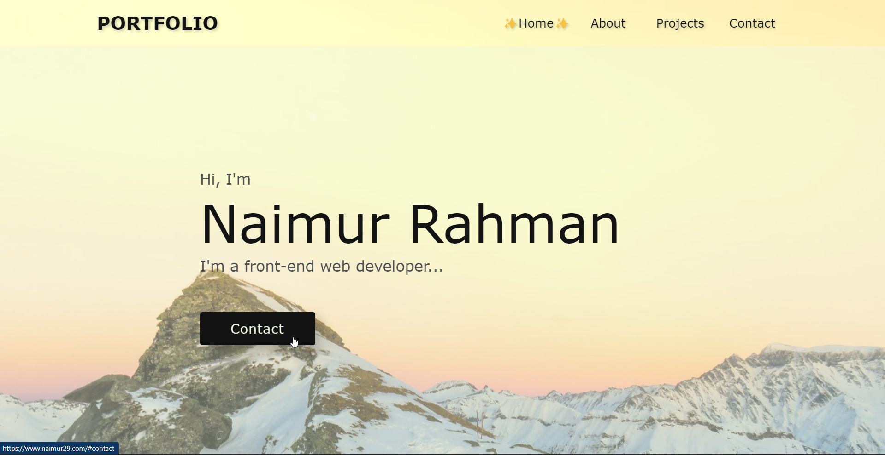

# [First Portfolio](https://www.naimur29.com/)

> This is my First Porfolio (unfinished)

---

### Header:

- [Description](#description)
- [How To Use](#how-to-use)

---

## Description

This is my first portfolio!! I had huge fun building this. I remember it literally took me 3+ weeks...   
Dev Goal: Build my first project ever...

### Packages:  
1.HTML & Vanilla CSS

### Some features of my project:  
1.This site is responsive for mobile and Desktop.  

---

## How To Use

If you want download this project you can download zip file or clone this site.
After download you open the project & click on the index.html file...

---

## Live link:
- [Click to visit my First Portfolio](https://www.naimur29.com/)
